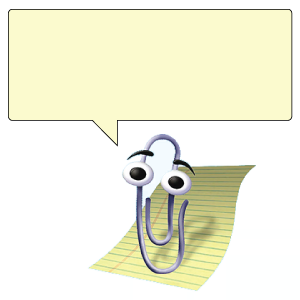

# Clippy Timer



This is a simple timer that will cause Clippy to popup with a custom message. I mostly use it to tell myself to get up from my desk.

## Configuration

All configuration is done in the config.txt file

```
#wait time is in seconds, so 3600 is 1 hour
WAIT_TIME = "3600"
#the program will exit after NO_RUN_AFTER, if this is set to True
NO_RUN_LIMIT = True
#this time is in military time/24 hour clock. this value is when the program will exit.
STOP_TIME = "17:00"
#this file is where you will store clippy's responses. Can fit about 66 characters
DIALOG_FILE = "dialog.txt"
#autoclose the popup after X seconds
AUTOCLOSE_AFTER = "5"
```

## Dialog

Whatever you want Clippy to say, simply add as a line in dialog.txt. Due to image size, we have about 66 characters, which is length of the default message.
